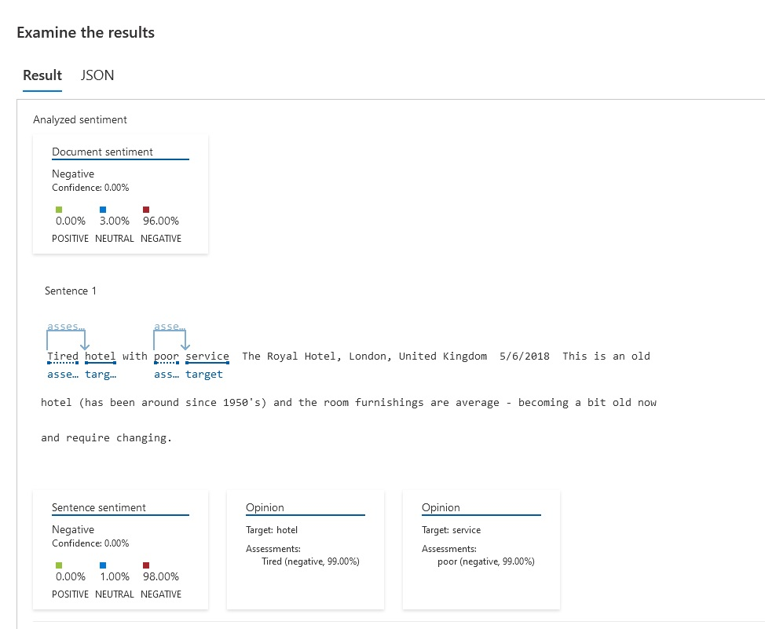
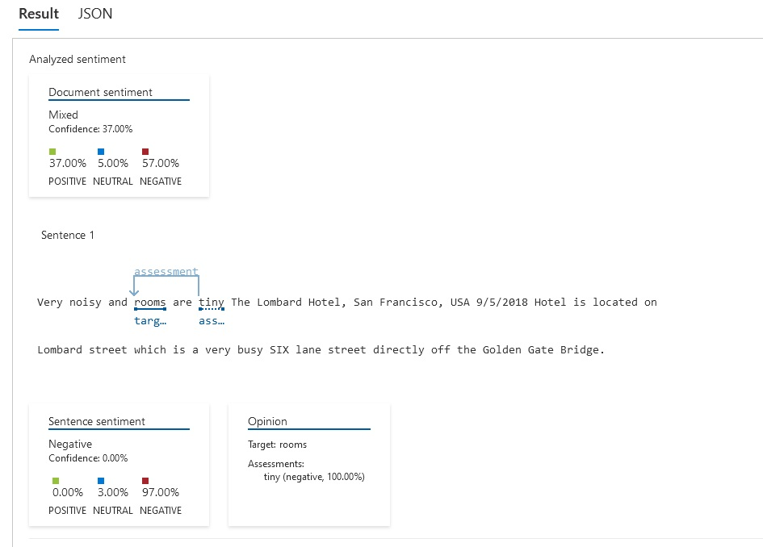

 ## Entrega do desafio da aula "Análise de Sentimentos com Language Studio no Azure AI" 
 ---

 Neste laboratório, foi possivel testar algumas funcionalidades do estúdio de fala e do language studio do Azure AI.
 No Speech Studio (https://speech.microsoft.com), fizemos um input de um áudio e o serviço fez a trasncrição correta dele.

 Já no Language Studio, foi possível utilizar o serviço de análise de sentimentos e opiniões. Nele realizamos o input de comentários de dois hoteis diferentes (ver sentences.txt).

 O Royal Hotel teve um comentário avalido com a análise negativa:
 

 O Lombard Hotel, por outro lado, já teve uma valiação um pouco mais positiva, apesar de algumas sentenças indicarem alguns aspectos negativos:
 

Fontes:

Estúdio de fala: https://aka.ms/ai900-speech

Language Studio: https://aka.ms/ai900-text-analysis
